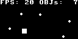

# micropython-appengine

[![PayPal Donate][paypal_img]][paypal_link]
[![PyPI version][pypi_img]][pypi_link]
[![Downloads][downloads_img]][downloads_link]

  [paypal_img]: https://github.com/jacklinquan/images/blob/master/paypal_donate_badge.svg
  [paypal_link]: https://www.paypal.me/jacklinquan
  [pypi_img]: https://badge.fury.io/py/micropython-appengine.svg
  [pypi_link]: https://badge.fury.io/py/micropython-appengine
  [downloads_img]: https://pepy.tech/badge/micropython-appengine
  [downloads_link]: https://pepy.tech/project/micropython-appengine

[Documentation](https://jacklinquan.github.io/micropython-appengine)

A MicroPython app engine.

This module works under MicroPython and it is tested with MicroPython V1.19.1.

## Installation

```python
>>> import upip
>>> upip.install('micropython-appengine')
```

Alternatively just copy `appengine.py` to the MicroPython device.

## Usage

- Subclass `InputDevice` for the input device.
- Subclass `Screen` for the screen.
- Subclass `Sprite` for all the sprites needed in the app.
- Subclass `Manager` for the app main control.

## Examples

### Demo


