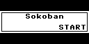
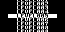
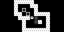

# Sokoban

## Hardware

- ESP32 DevKitC
- SSD1306 128x64 OLED with I2C interface
    - `SCL` on pin 16
    - `SDA` on pin 17
- Touchpads
    - `BACK` on pin 32
    - `UP` on pin 15
    - `ENTER` on pin 4
    - `LEFT` on pin 27
    - `DOWN` on pin 12
    - `RIGHT` on pin 2

## Firmware

- MicroPython V1.19.1.

## Required Modules

- `ssd1306`
- `micropython-microbmp`
- `micropython-appengine`

## Required Assets

- `images`
- `levels`

## Screen Shot

